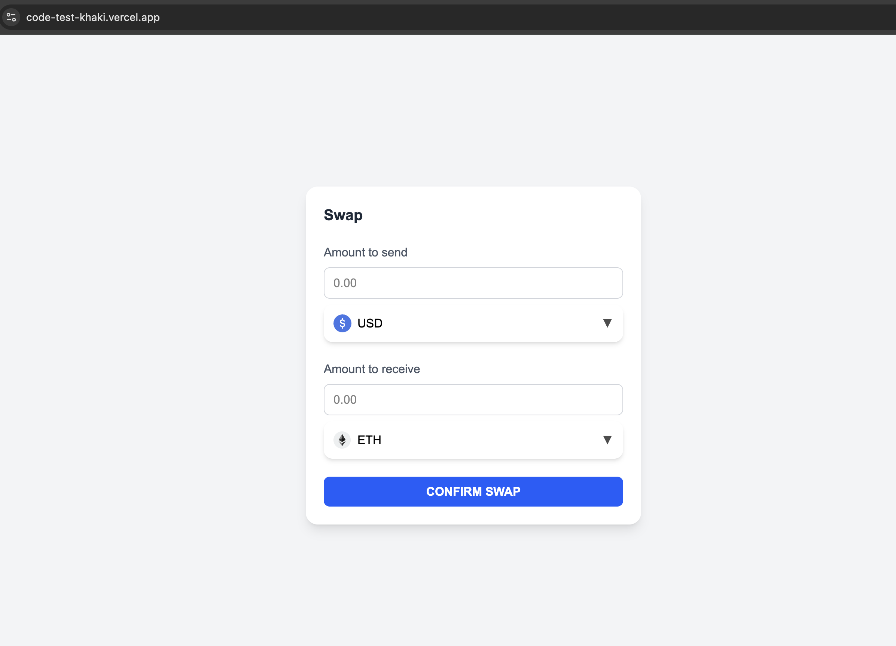
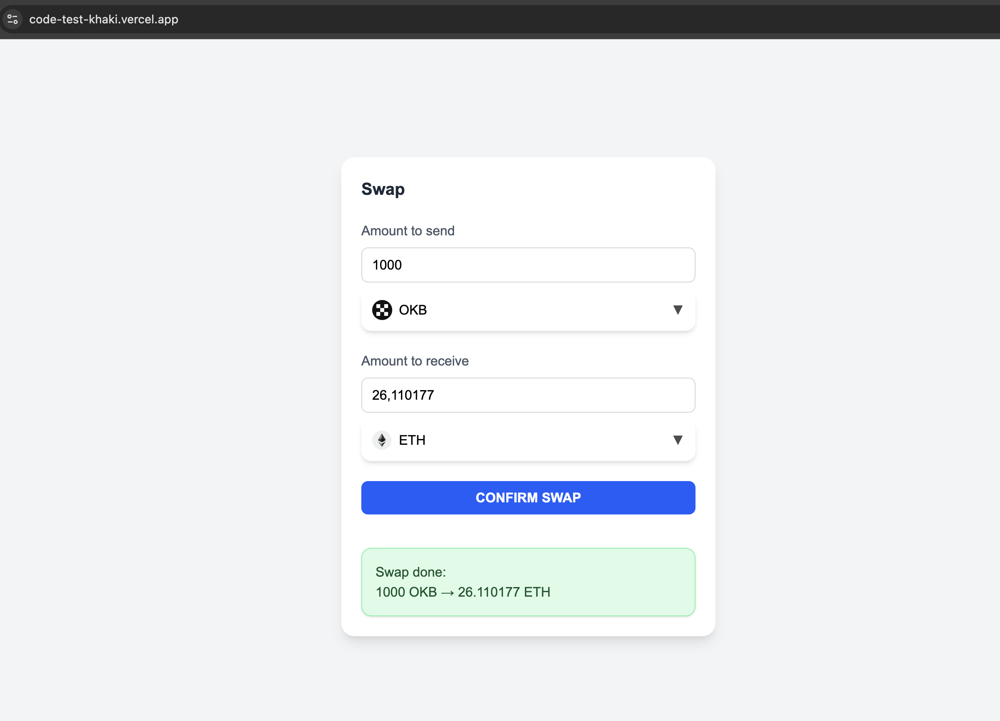
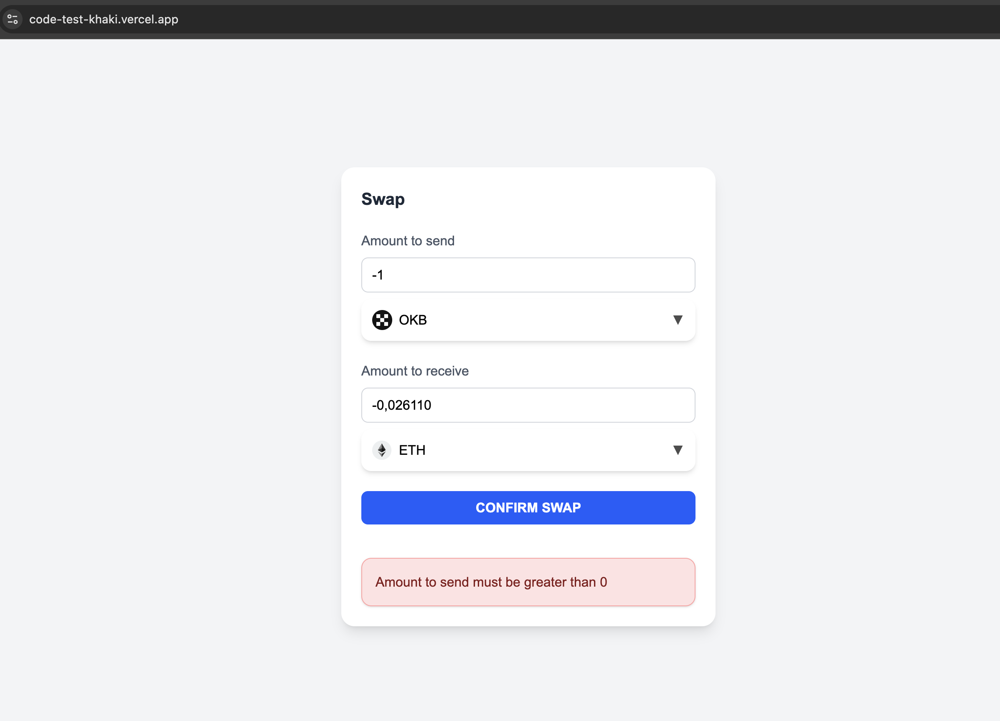

## Prerequisites

- Make sure you have Node.js and npm installed.
- Install project dependencies:

```bash
npm install
```

## Running the Project

- Start the development server:

```bash
npm run dev
```

- Can visit this site for project's preview
https://code-test-khaki.vercel.app/




