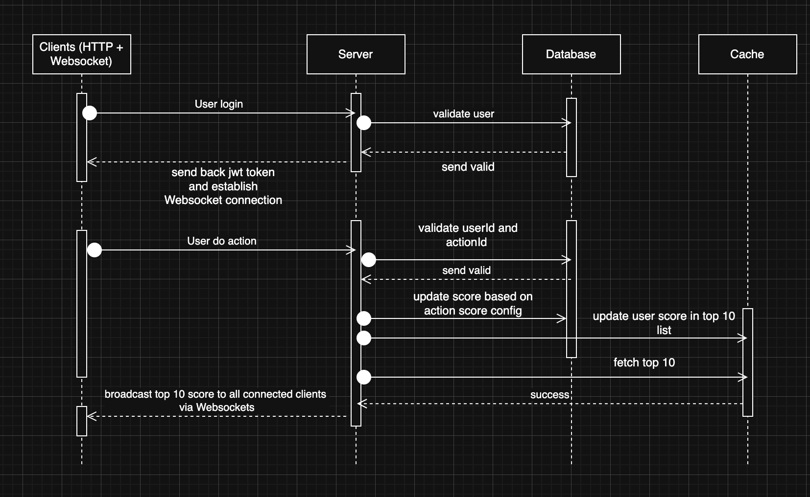

## Functional Requirements

1. **User Do Action and Score Update in Backend side**
    - Endpoint: `POST /api/action/do`
    - Headers:
      ```http
      Authorization: Bearer <jwt_token>
      Content-Type: application/json
      ```
    - Body:
      ```json
      {
        "actionId": "string"
      }
      ```
    - Output:
      ```json
      {
        "success": true,
        "newScore": 12345
      }
      ```
    - Description:
      - Extracts `userId` from the `jwt_token`.
      - Validates `actionId` and check completion to determine how much score to increment (check action score configuration in DB or in json/csv file).
      - Updates the user's score in the database.
      - Updates cached top 10 scores.
      - Broadcasts updated top 10 scores to all connected clients via WebSocket.

2. **Retrieve Top Scores**
    - Endpoint: `GET /api/score/top`
    - Headers:
      ```http
      Authorization: Bearer <jwt_token>
      ```
    - Input: None
    - Output:
      ```json
      [
        { "userId": "user1", "score": 1200 },
        { "userId": "user2", "score": 1100 },
        ...
      ]
      ```
    - Description:
      - Validates `jwt_token`.
      - Returns the top 10 users ordered by score from cache
      - if expired or not existed from cache, then get from db and re-cached top 10 in redis.

---

## Non-Functional Requirements

- **Security**
  - All score update requests must include a valid `jwt_token`.
  - Use JWT or API key validation for authorization.
  - Rate limiting per user to prevent abuse.

- **Performance**
  - Score updates should reflect in live scoreboard **within 1 second**.
  - Use in-memory caching (e.g., Redis) with expiration to maintain the top 10 leaderboard for fast reads.

- **Reliability**
  - Handle concurrent updates safely using transactions or atomic operations.
  - Fallback: in case of a cache miss, retrieve from the database.

---

## Data Model

- **UserScore**
  | Field      | Type    | Description                   |
  |------------|---------|-------------------------------|
  | userId     | string  | Unique user identifier        |
  | score      | integer | Current total score           |
  | updatedAt  | datetime| Last score update timestamp   |

---

## Architecture & Flow

### Execution Flow

1. User login, backend validates, if ok, send back `jwt_token` for authentication and establishes a websocket connection
2. User completes an action on the website.
3. Frontend sends `POST /api/action/do` with `actionId` in body and `jwt_token` in headers.
4. Backend validates `jwt_token`, extract userId from it and call db to validate `actionId`.
5. If valid and action completed, backend updates the score in the database (and cache) based on the actionId score config.
6. Backend fetches the updated top 10 scores.
7. Backend broadcasts the updated top 10 scores to all connected clients via WebSocket.
8. Frontend displays the updated top 10 live.

